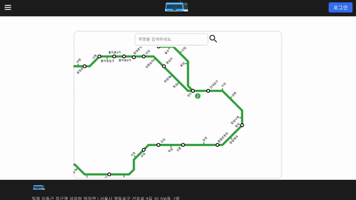
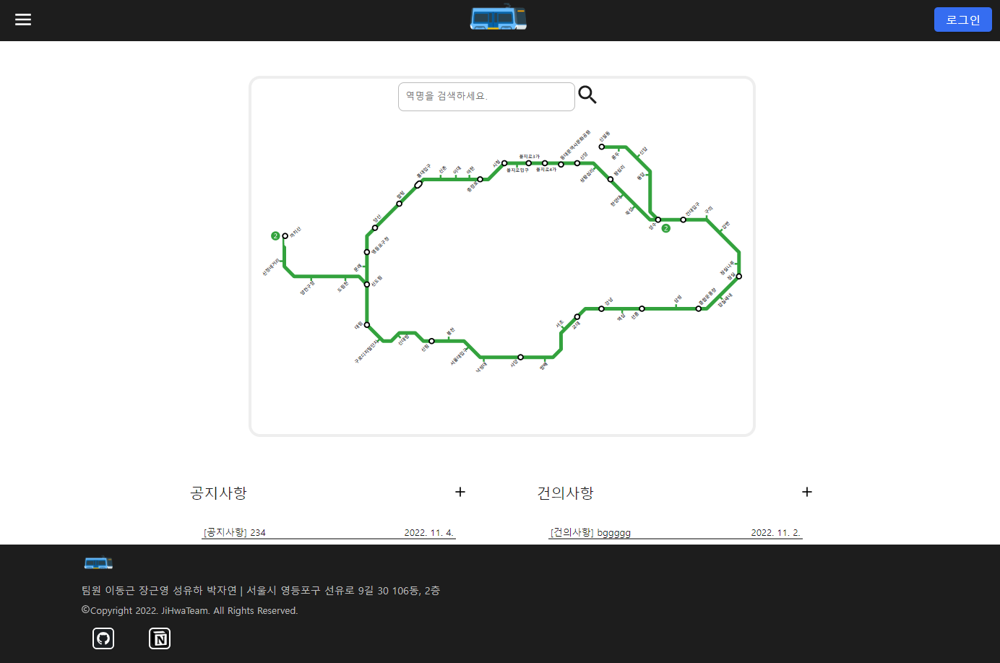
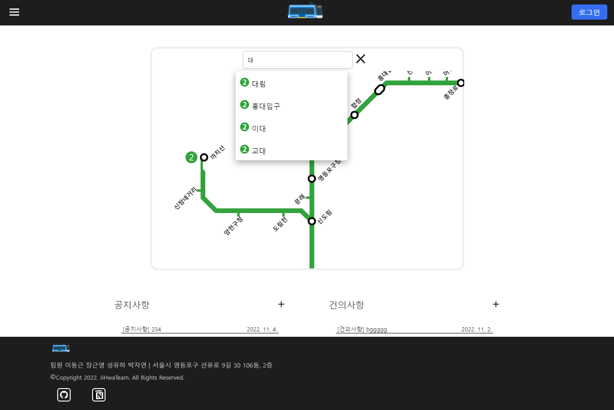
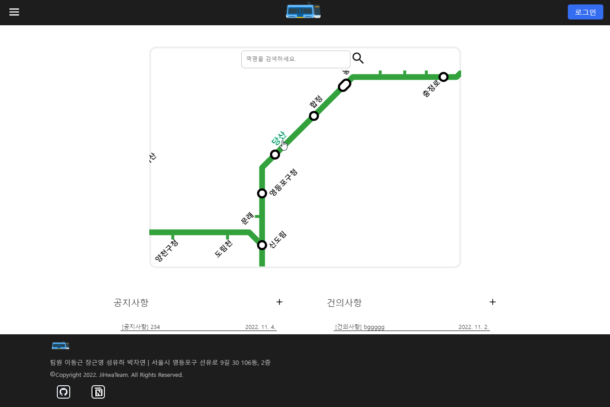
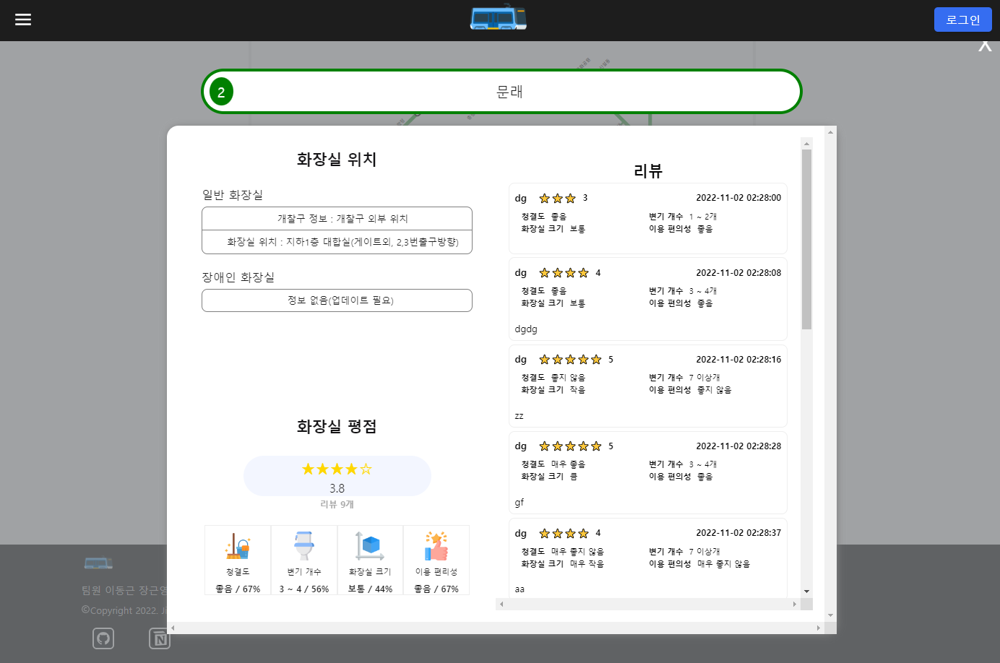
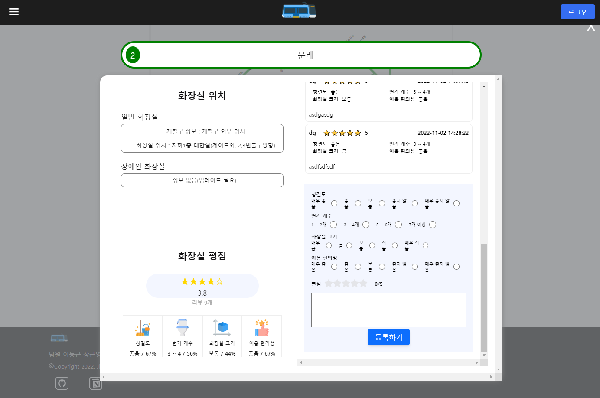
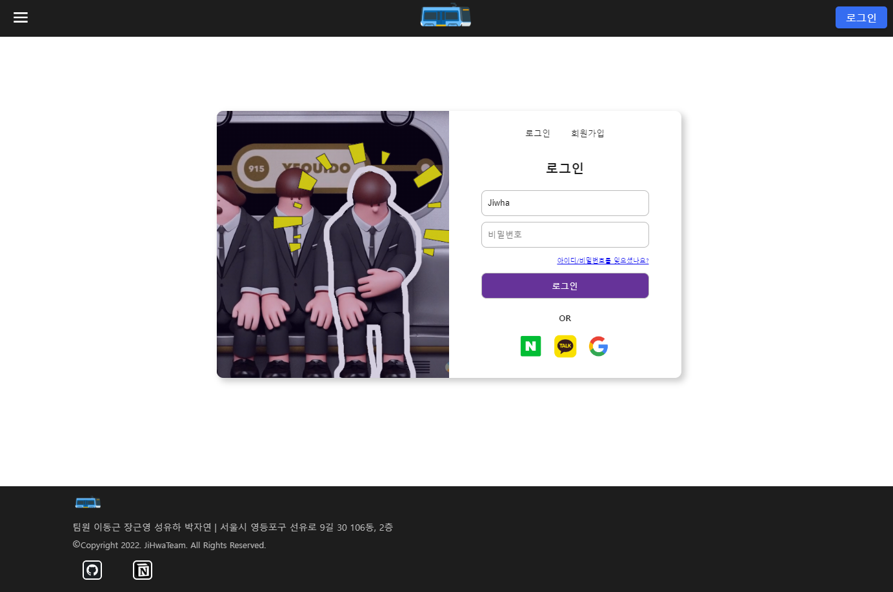
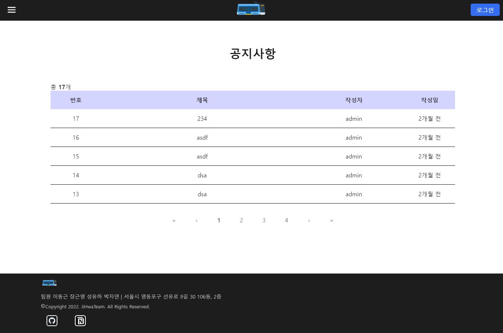
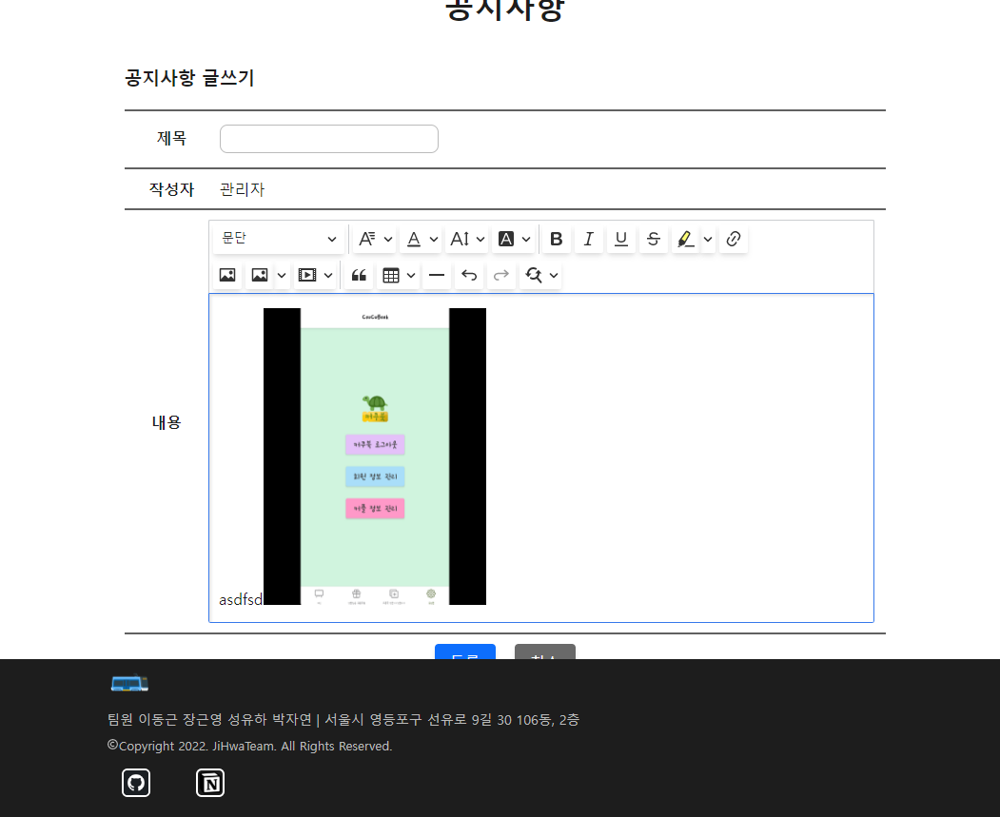

# SubwayToilet
  

---
## Description
React, Nodejs, 지하철 화장실 API를 이용하여  
지하철 화장실 위치 정보 제공 및 지하철 화장실 평점, 리뷰 제공 웹사이트 개발 프로젝트  
개발기간: 2022.10.17 ~ 2022.11.02

---
## Team JIWHA
|  |  |  |  | 
| :------------------------------------------: | :-----------------------------------------: | :-------------------------------------------------: | :------------------------------------------: | 
|       [이동근](https://github.com/Mokdasoo) 프론트엔드     |      [성유하](https://github.com/sungyuha)  프론트엔드    |      [장근영](https://github.com/GYoungJang)  백엔드    |      [박자연](https://github.com/Ethanolll)   프론트엔드   |    

---

## 배포 주소
http://13.125.248.225:3000

---

## 기술

 

 
 
  

---

## 프로젝트 스크린샷, 설명

 

### 마우스 휠, 드래그 로 노선도 이미지를 자유롭게 확대, 축소, 이동이 가능하고 원하는 역을 선택할 수 있습니다.

 

 

### 검색으로 선택도 가능합니다.

 

 

### 역을 선택하면 해당 역에 대한 정보와 리뷰, 평점을 볼 수 있습니다.

 

 

### 로그인을 하면 평점과 리뷰를 등록할 수 있습니다.

 

 

### 공지사항 게시판, 건의 게시판이 있고 글과 이미지를 자유롭게 올릴 수 있습니다.

 

---

## 깃 작업 순서  
1. git pull(develop 메인 브랜치 최신화)
1. git checkout -b feature/본인맡은기능이름 (브랜치 만들기)
1. 만든 브랜치에서 작업
1. git add . -> git commit -m "작업내용" -> git push origin 작업한브랜치이름
1. 깃헙 프로젝트 페이지 가서 머지 완료
1. 콘솔로 돌아와서 -> git checkout develop (develop 브랜치로 전환)
1. git pull
1. git branch -d 작업했던브랜치이름 (본인 로컬에 남아 있는 작업브랜치 삭제)
